# 修仙体系关系图

本目录包含从 `data/relations.yaml` 自动/手工绘制的 mermaid 图。

## 境界晋升图

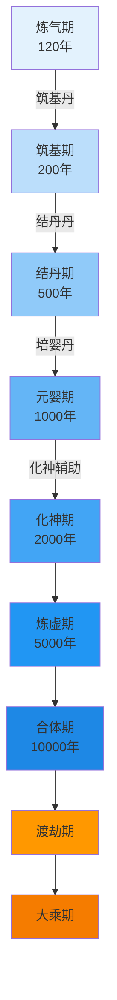

## 灵根 → 修炼速度

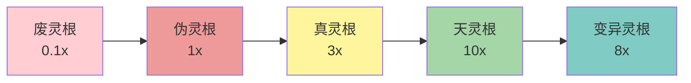

## 丹药-境界映射

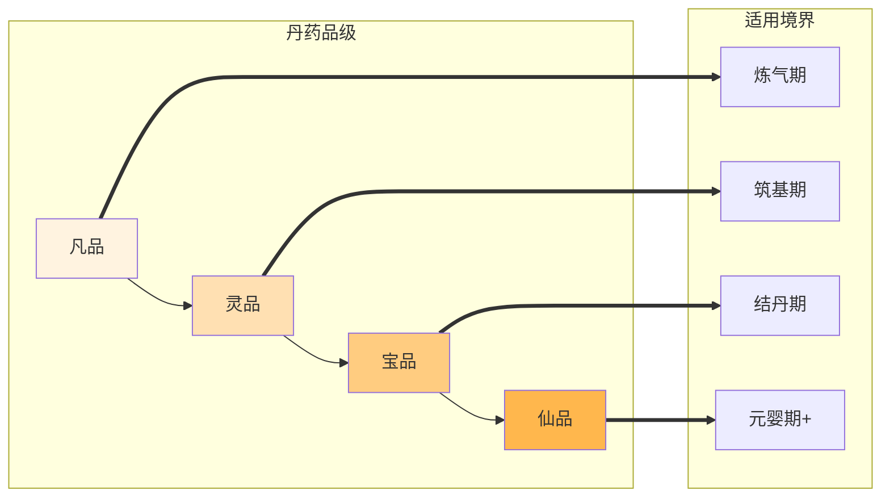

## 功法-境界映射

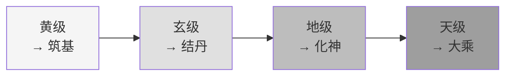

## 体系全景图

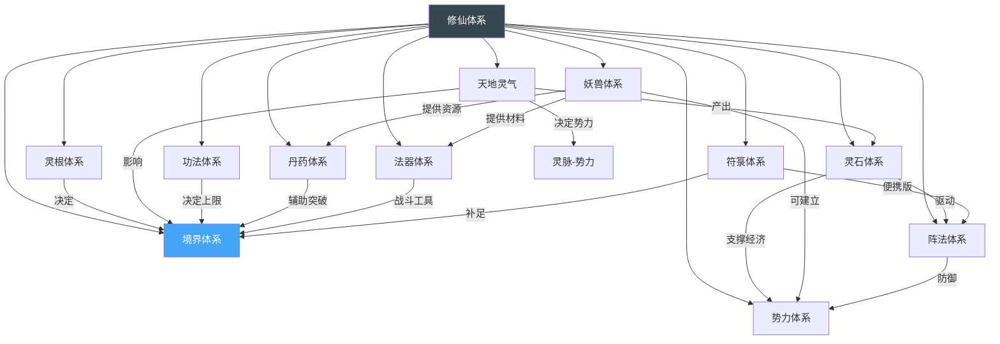

## 灵脉等级-势力规模

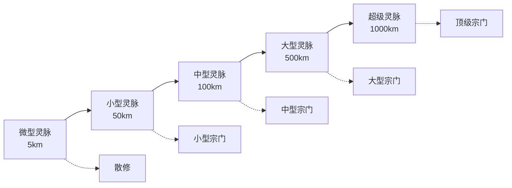

## 雷劫-境界映射（v1.5 新增）

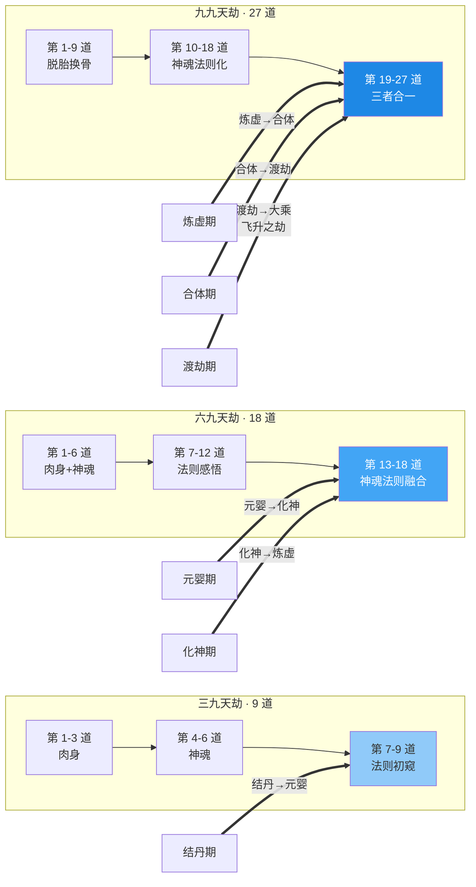

## 心魔-境界映射（v1.5 新增）

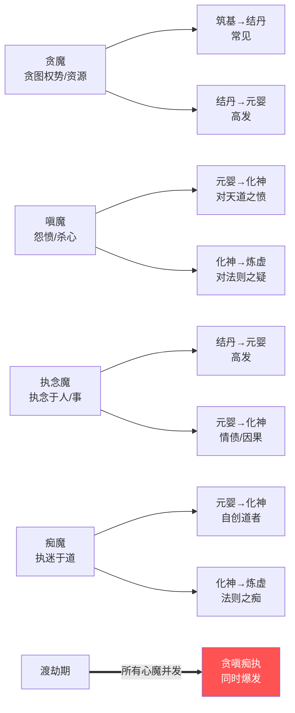

## 器灵-法器映射（v1.7 新增）

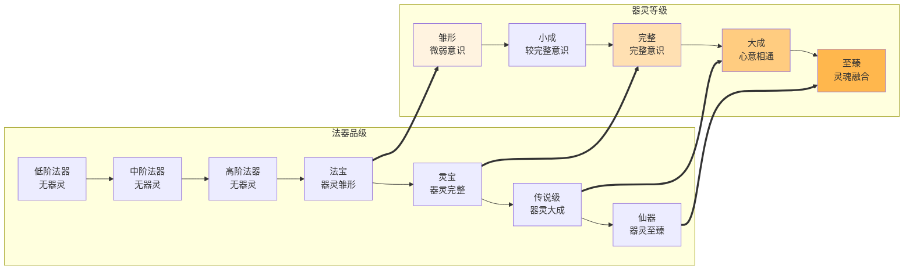

## 契约-对象映射（v1.7 新增）

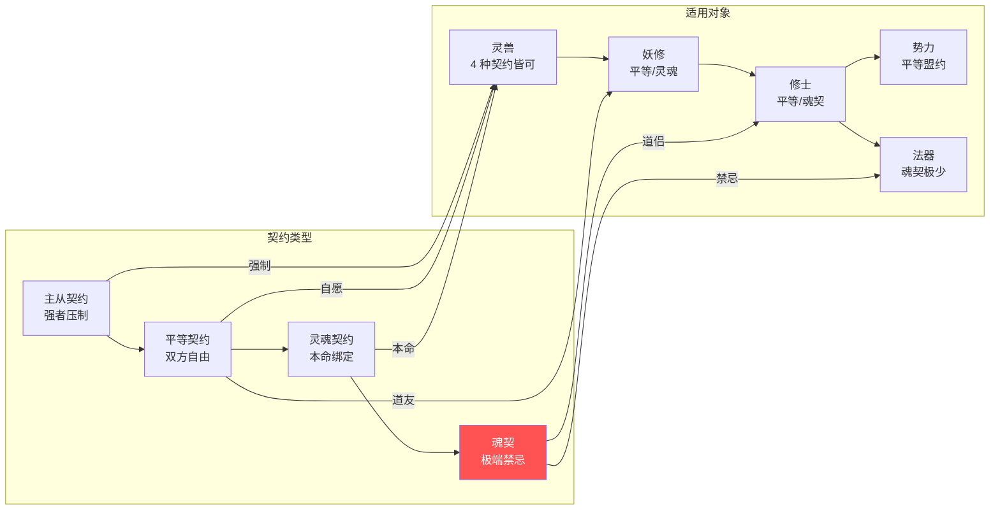

## 神识攻击（v1.6 新增）

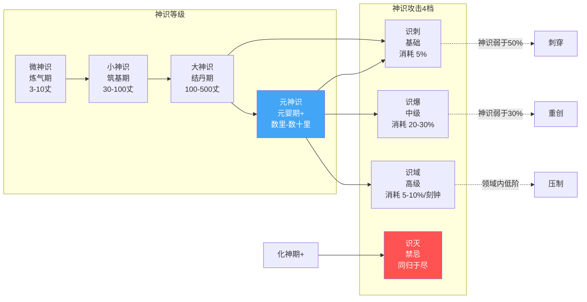

## 飞升 / 仙界（v2.0 新增）

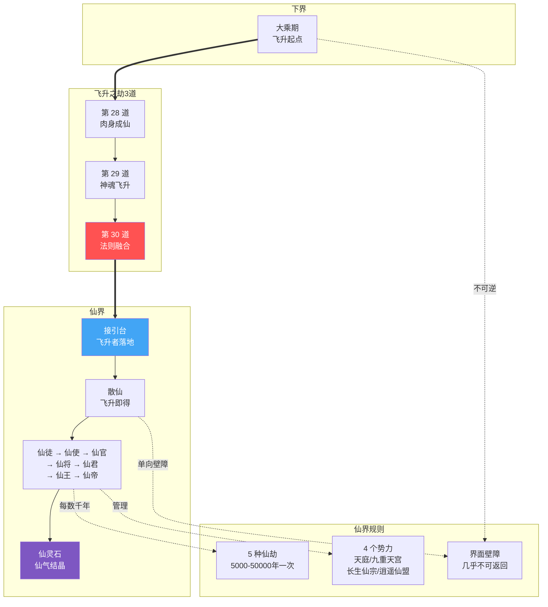

## 飞升之劫 vs 雷劫对比

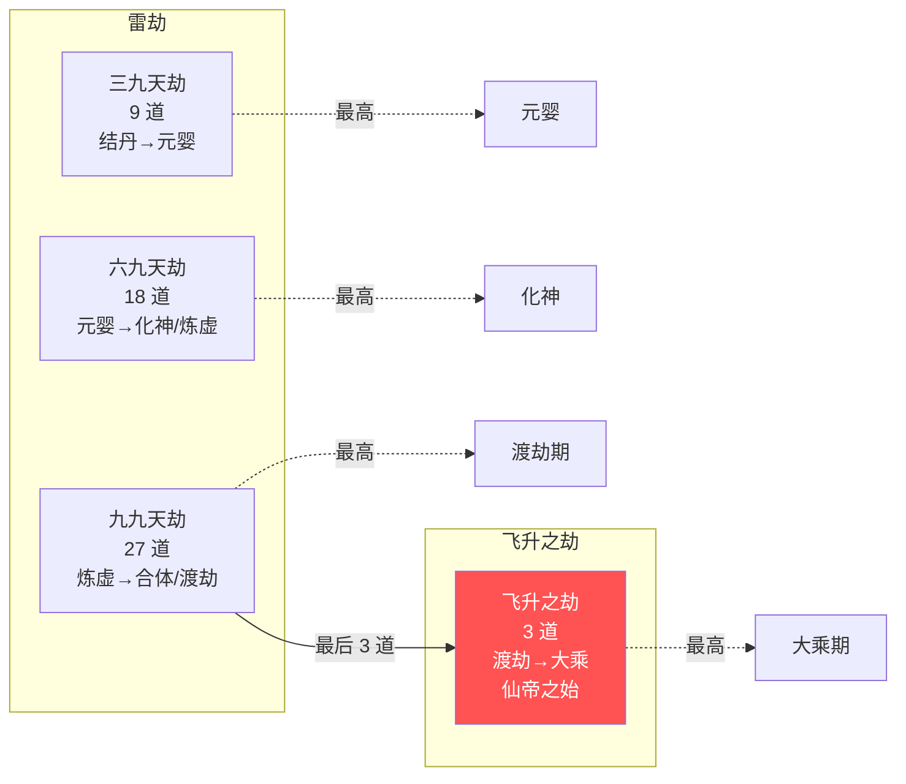

> 提示：GitHub / VS Code / Typora 等支持 mermaid 的渲染器会直接显示图。
> 渲染失败时检查 `data/relations.yaml` 中的 id 是否对应 `data/*.yaml` 中实际存在的 id。

## 自动生成的全图（v2.9 新增）

通过 `python3 scripts/build_graph.py --mermaid <输出>` 自动从 `data/relations.yaml` + `data/*.yaml` 生成：

- **节点数**：161
- **边数**：221
- **体系数**：45+

```mermaid
flowchart LR
    subgraph spirit_root ["spirit_root (9)"]
        spirit_root_tian_ling_gen["tian_ling_gen"]
        spirit_root_wei_ling_gen["wei_ling_gen"]
        spirit_root_jian_gen["jian_gen"]
        spirit_root_ji_yang_gen["ji_yang_gen"]
        spirit_root_zhao_yao_gen["zhao_yao_gen"]
        spirit_root_ming_gen["ming_gen"]
        spirit_root_ji_yin_gen["ji_yin_gen"]
        spirit_root_yu_lei_gen["yu_lei_gen"]
        spirit_root_han_bing_gen["han_bing_gen"]
    end
    subgraph attributes ["attributes (1)"]
        attributes_jin["jin"]
    end
    subgraph aether ["aether (3)"]
        aether_xi_bao["xi_bao"]
        aether_nong_yu["nong_yu"]
        aether_wei_xing_lingmai["wei_xing_lingmai"]
    end
    subgraph technique ["technique (12)"]
        technique_huang["huang"]
        technique_xuan["xuan"]
        technique_di["di"]
        technique_tian["tian"]
        technique_jin_gang_gong["jin_gang_gong"]
        technique_lei_dian_jue["lei_dian_jue"]
        technique_you_ming_jue["you_ming_jue"]
        technique_mo_shen_jue["mo_shen_jue"]
        technique_tai_yi_jue["tai_yi_jue"]
        technique_cang_lang_jue["cang_lang_jue"]
        technique_hun_yuan_gong["hun_yuan_gong"]
        technique_tian_di_jue["tian_di_jue"]
    end
    subgraph elixir ["elixir (12)"]
        elixir_fan_pin["fan_pin"]
        elixir_ling_pin["ling_pin"]
        elixir_bao_pin["bao_pin"]
        elixir_xian_pin["xian_pin"]
        elixir_zhuji_dan["zhuji_dan"]
        elixir_jiedan_dan["jiedan_dan"]
        elixir_peiyu_dan["peiyu_dan"]
        elixir_qing_xin_dan["qing_xin_dan"]
        elixir_qing_xin_dan_advanced["qing_xin_dan_advanced"]
        elixir_ning_shen_dan["ning_shen_dan"]
        elixir_du_e_dan["du_e_dan"]
        elixir_hu_shen_dan["hu_shen_dan"]
    end
    subgraph realm ["realm (9)"]
        realm_jiedan["jiedan"]
        realm_yuanying["yuanying"]
        realm_huashen["huashen"]
        realm_lianxu["lianxu"]
        realm_heti["heti"]
        realm_dujie["dujie"]
        realm_zhuji["zhuji"]
        realm_lianqi["lianqi"]
        realm_dacheng["dacheng"]
    end
    subgraph tribulation ["tribulation (6)"]
        tribulation_san_jiu_tian_jie["san_jiu_tian_jie"]
        tribulation_liu_jiu_tian_jie["liu_jiu_tian_jie"]
        tribulation_jiu_jiu_tian_jie["jiu_jiu_tian_jie"]
        tribulation_jiu_jiu_tian_jie_feisheng["jiu_jiu_tian_jie_feisheng"]
        tribulation_hua_shou["hua_shou"]
        tribulation_xian_jie_tian_jie["xian_jie_tian_jie"]
    end
    subgraph formation ["formation (3)"]
        formation_du_jie_zhen["du_jie_zhen"]
        formation_tian_gang_zhen["tian_gang_zhen"]
        formation_ju_ling_zhen["ju_ling_zhen"]
    end
    subgraph divine_sense ["divine_sense (4)"]
        divine_sense_jiedan["jiedan"]
        divine_sense_yuanying["yuanying"]
        divine_sense_zhuji["zhuji"]
        divine_sense_huashen["huashen"]
    end
    subgraph heart_demon ["heart_demon (10)"]
        heart_demon_chi_mo["chi_mo"]
        heart_demon_zhi_nian_mo["zhi_nian_mo"]
        heart_demon_wu_mo["wu_mo"]
        heart_demon_ai_mo["ai_mo"]
        heart_demon_e_mo["e_mo"]
        heart_demon_sheng_si_mo["sheng_si_mo"]
        heart_demon_qie_mo["qie_mo"]
        heart_demon_ai_guo_mo["ai_guo_mo"]
        heart_demon_tan_mo["tan_mo"]
        heart_demon_yu_mo["yu_mo"]
    end
    subgraph artifact ["artifact (3)"]
        artifact_fa_bao["fa_bao"]
        artifact_ling_bao["ling_bao"]
        artifact_ling_shou_dai["ling_shou_dai"]
    end
    subgraph spirit_weapon ["spirit_weapon (3)"]
        spirit_weapon_zi_yuan["zi_yuan"]
        spirit_weapon_chu_ling["chu_ling"]
        spirit_weapon_wu_ji["wu_ji"]
    end
    subgraph spirit_beast ["spirit_beast (1)"]
        spirit_beast_ling_pin["ling_pin"]
    end
    subgraph yao_xiu ["yao_xiu (1)"]
        yao_xiu_hua_xing["hua_xing"]
    end
    subgraph org ["org (1)"]
        org_top_sect["top_sect"]
    end
    subgraph contract ["contract (5)"]
        contract_master_servant["master_servant"]
        contract_soul_bond["soul_bond"]
        contract_blood_contract["blood_contract"]
        contract_tian_dao_contract["tian_dao_contract"]
        contract_lian_hun_contract["lian_hun_contract"]
    end
    subgraph ascension ["ascension (6)"]
        ascension_ascension_tribulation["ascension_tribulation"]
        ascension_unidirectional["unidirectional"]
        ascension_ordinary["ordinary"]
        ascension_talented["talented"]
        ascension_legendary["legendary"]
        ascension_ghost["ghost"]
    end
    subgraph realms ["realms (6)"]
        realms_xian_jie["xian_jie"]
        realms_dacheng["dacheng"]
        realms_ren_xian["ren_xian"]
        realms_xian_di["xian_di"]
        realms_shen_di["shen_di"]
        realms_tian_xian["tian_xian"]
    end
    subgraph spirit_stone ["spirit_stone (7)"]
        spirit_stone_ji_pin["ji_pin"]
        spirit_stone_xian_pin["xian_pin"]
        spirit_stone_long["long"]
        spirit_stone_shen["shen"]
        spirit_stone_mo["mo"]
        spirit_stone_ming["ming"]
        spirit_stone_tian_lei["tian_lei"]
    end
    subgraph factions ["factions (1)"]
        factions_tian_ting["tian_ting"]
    end
    subgraph immortal_tribulations ["immortal_tribulations (1)"]
        immortal_tribulations_lei_xian_jie["lei_xian_jie"]
    end
    subgraph barrier_types ["barrier_types (1)"]
        barrier_types_sealed["sealed"]
    end
    subgraph titles ["titles (1)"]
        titles_xian_di["xian_di"]
    end
    subgraph divine_grades ["divine_grades (3)"]
        divine_grades_fan_ren["fan_ren"]
        divine_grades_zhi_shen["zhi_shen"]
        divine_grades_dao_zu_ge["dao_zu_ge"]
    end
    subgraph spirit_stones ["spirit_stones (1)"]
        spirit_stones_xian_jing["xian_jing"]
    end
    subgraph demon_aether ["demon_aether (2)"]
        demon_aether_xi_mo["xi_mo"]
        demon_aether_mo_yuan["mo_yuan"]
    end
    subgraph demon_titles ["demon_titles (1)"]
        demon_titles_mo_di["mo_di"]
    end
    subgraph demon_races ["demon_races (1)"]
        demon_races_ren_zu_mo["ren_zu_mo"]
    end
    subgraph demon_grades ["demon_grades (1)"]
        demon_grades_fan_mo["fan_mo"]
    end
    subgraph underworld_titles ["underworld_titles (1)"]
        underworld_titles_ming_di["ming_di"]
    end
    subgraph underworld_tribulations ["underworld_tribulations (1)"]
        underworld_tribulations_wan_hun_shi_xin_jie["wan_hun_shi_xin_jie"]
    end
    subgraph underworld_races ["underworld_races (2)"]
        underworld_races_gui_zu["gui_zu"]
        underworld_races_pan_guan_zu["pan_guan_zu"]
    end
    subgraph underworld_domains ["underworld_domains (2)"]
        underworld_domains_liu_dao_lun_hui_si["liu_dao_lun_hui_si"]
        underworld_domains_feng_du["feng_du"]
    end
    subgraph demon_tribulations ["demon_tribulations (1)"]
        demon_tribulations_xin_mo_jie["xin_mo_jie"]
    end
    subgraph underworld_aether ["underworld_aether (1)"]
        underworld_aether_si_yuan["si_yuan"]
    end
    subgraph shen_tong ["shen_tong (4)"]
        shen_tong_zi_dian_shen_lei["zi_dian_shen_lei"]
        shen_tong_wan_xiang_tian_yin["wan_xiang_tian_yin"]
        shen_tong_zhu_shen_jian_jue["zhu_shen_jian_jue"]
        shen_tong_hun_yuan_shen_li["hun_yuan_shen_li"]
    end
    subgraph dun_shu ["dun_shu (2)"]
        dun_shu_jin_dun["jin_dun"]
        dun_shu_shui_dun["shui_dun"]
    end
    subgraph fa_xiang ["fa_xiang (2)"]
        fa_xiang_jin_gang_fa_xiang["jin_gang_fa_xiang"]
        fa_xiang_qing_lian_fa_xiang["qing_lian_fa_xiang"]
    end
    subgraph examples ["examples (12)"]
        examples_jiu_xiao_lei_zhen["jiu_xiao_lei_zhen"]
        examples_huo_yan_dong["huo_yan_dong"]
        examples_tian_shan_school["tian_shan_school"]
        examples_tian_long_shan["tian_long_shan"]
        examples_qi_lin_ting["qi_lin_ting"]
        examples_feng_huang_ling["feng_huang_ling"]
        examples_wan_yao_lin["wan_yao_lin"]
        examples_qi_lin["qi_lin"]
        examples_feng_huang["feng_huang"]
        examples_jin_chi_da_peng["jin_chi_da_peng"]
        examples_tai_yi_gong["tai_yi_gong"]
        examples_ji_yin_si["ji_yin_si"]
    end
    subgraph divine_power ["divine_power (10)"]
        divine_power_fa_tian_xiang_di["fa_tian_xiang_di"]
        divine_power_ling_yu_zhan_kai["ling_yu_zhan_kai"]
        divine_power_lun_hui_zhi_yan["lun_hui_zhi_yan"]
        divine_power_xian_di_wei_ya["xian_di_wei_ya"]
        divine_power_shi_jian_jing_zhi["shi_jian_jing_zhi"]
        divine_power_shen_wang_li_zhi["shen_wang_li_zhi"]
        divine_power_san_tou_liu_bi["san_tou_liu_bi"]
        divine_power_kong_jian_yi_dong["kong_jian_yi_dong"]
        divine_power_bu_xiu_shen["bu_xiu_shen"]
        divine_power_qian_li_chuan_yin["qian_li_chuan_yin"]
    end
    subgraph talisman ["talisman (2)"]
        talisman_wan_fu_fu["wan_fu_fu"]
        talisman_du_jie_fu["du_jie_fu"]
    end
    subgraph ascension_tribulation ["ascension_tribulation (1)"]
        ascension_tribulation_ascension_tribulation["ascension_tribulation"]
    end
    subgraph paths ["paths (1)"]
        paths_bei_pai["bei_pai"]
    end
    subgraph ascension_types ["ascension_types (1)"]
        ascension_types_evil["evil"]
    end
    subgraph counter_elixirs ["counter_elixirs (3)"]
        counter_elixirs_ji_kong_dan["ji_kong_dan"]
        counter_elixirs_wu_ruo_dan["wu_ruo_dan"]
        counter_elixirs_duan_yu_dan["duan_yu_dan"]
    end
    spirit_root_tian_ling_gen -->|influences| realm_lianqi
    spirit_root_wei_ling_gen -->|blocks| realm_zhuji
    spirit_root_tian_ling_gen -->|enables| technique_chang_sheng_jue
    attributes_jin -->|enables| technique_jin_jian_jue
    aether_xi_bao -->|enables| realm_lianqi
    aether_nong_yu -->|enables| realm_jiedan
    aether_wei_xing_lingmai -->|enables| org_san_xiu
    technique_huang -->|blocks| realm_zhuji
    technique_xuan -->|enables| realm_jiedan
    technique_di -->|enables| realm_huashen
    technique_tian -->|enables| realm_dacheng
    elixir_fan_pin -->|enables| realm_lianqi
    elixir_ling_pin -->|enables| realm_zhuji
    elixir_bao_pin -->|enables| realm_jiedan
    elixir_xian_pin -->|enables| realm_yuanying
    elixir_zhuji_dan -->|enables| realm_zhuji
    elixir_jiedan_dan -->|enables| realm_jiedan
    elixir_peiyu_dan -->|enables| realm_yuanying
    realm_jiedan -->|requires| tribulation_san_jiu_tian_jie
    realm_yuanying -->|requires| tribulation_liu_jiu_tian_jie
    realm_huashen -->|requires| tribulation_liu_jiu_tian_jie
    realm_lianxu -->|requires| tribulation_jiu_jiu_tian_jie
    realm_heti -->|requires| tribulation_jiu_jiu_tian_jie
    realm_dujie -->|requires| tribulation_jiu_jiu_tian_jie_feisheng
    realm_zhuji -->|blocks| heart_demon_tan_mo
    realm_jiedan -->|blocks| heart_demon_zhi_nian_mo
    realm_yuanying -->|blocks| heart_demon_chi_mo
    realm_huashen -->|blocks| heart_demon_chi_mo
    tribulation_san_jiu_tian_jie -->|triggers| heart_demon_tan_mo
    tribulation_liu_jiu_tian_jie -->|triggers| heart_demon_chi_mo
    tribulation_jiu_jiu_tian_jie -->|triggers| heart_demon_all
    elixir_qing_xin_dan -->|enables| heart_demon_tan_mo
    elixir_qing_xin_dan_advanced -->|enables| heart_demon_zhi_nian_mo
    elixir_ning_shen_dan -->|enables| heart_demon_chi_mo
    formation_du_jie_zhen -->|all_aggregate| tribulation_san_jiu_tian_jie
    formation_du_jie_zhen -->|all_aggregate| tribulation_liu_jiu_tian_jie
    formation_du_jie_zhen -->|all_aggregate| tribulation_jiu_jiu_tian_jie
    realm_lianqi -->|enables| divine_sense_lianqi
    realm_zhuji -->|enables| divine_sense_zhuji
    realm_jiedan -->|enables| divine_sense_jiedan
    realm_yuanying -->|enables| divine_sense_yuanying
    divine_sense_jiedan -->|enables| artifact_gao_jie
    divine_sense_yuanying -->|enables| artifact_fa_bao
    divine_sense_zhuji -->|enables| talisman_ling_fu
    divine_sense_jiedan -->|enables| talisman_bao_fu
    divine_sense_zhuji -->|enables| elixir_ling_pin
    divine_sense_jiedan -->|enables| elixir_bao_pin
    divine_sense_zhuji -->|enables| formation_ling_zhen
    divine_sense_jiedan -->|enables| formation_bao_zhen
    divine_sense_yuanying -->|blocks| heart_demon_all
```