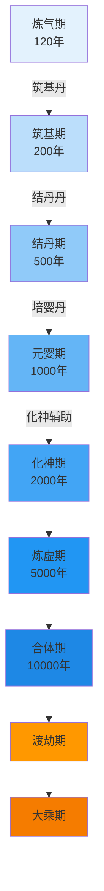
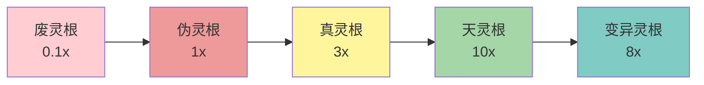
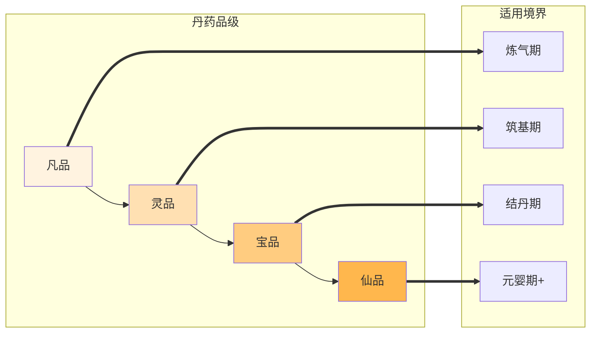
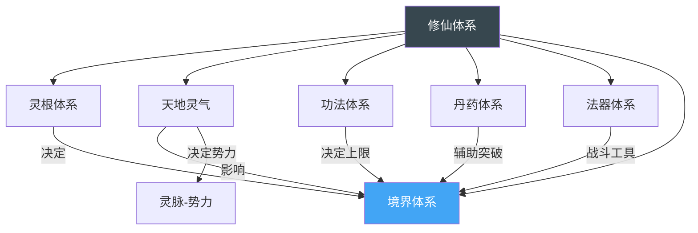
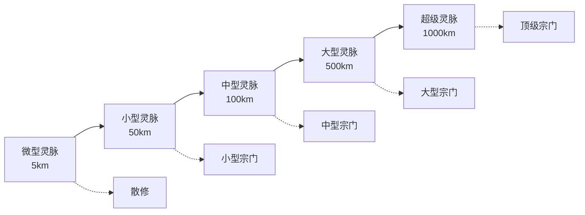

# 修仙体系关系图

本目录包含从 `data/relations.yaml` 自动/手工绘制的 mermaid 图。

## 境界晋升图

## 灵根 → 修炼速度

## 丹药-境界映射

## 功法-境界映射

## 体系全景图

## 灵脉等级-势力规模

> 提示：GitHub / VS Code / Typora 等支持 mermaid 的渲染器会直接显示图。
> 渲染失败时检查 `data/relations.yaml` 中的 id 是否对应 `data/*.yaml` 中实际存在的 id。